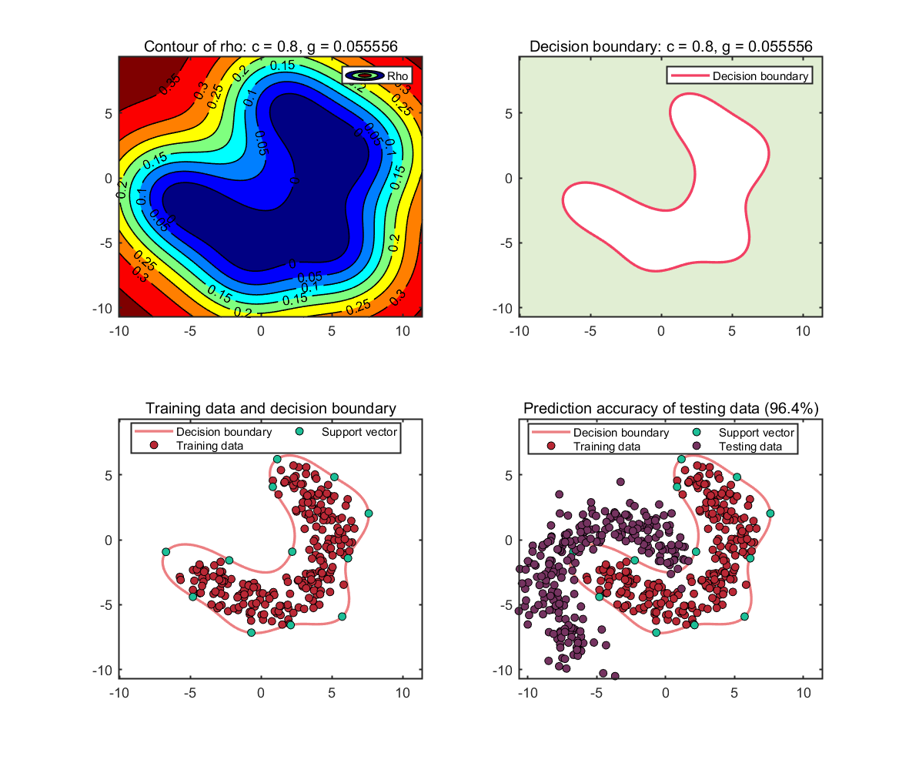

# Decision-Boundaries-Visualization-of-SVDD-libsvm-3.23
 Decision Boundaries Visualization of SVDD (libsvm-3.23)
 
## Description
Support Vector Data Description (SVDD) is a one-classification algorithm.
This code is written for decision boundary visualization of SVDD in the libsvm-3.23 toolbox. Details are described as follows :
1. Built the SVDD hypersphere model of the training set.
2. Fill the training set area with the grid method.
3. Predict the score of each grid point.
4. Draw contour lines based on grid point scores.
5. Draw decision boundaries.

## Demo (banana dataset)

### Underfitting

### Normal

### Overfitting

